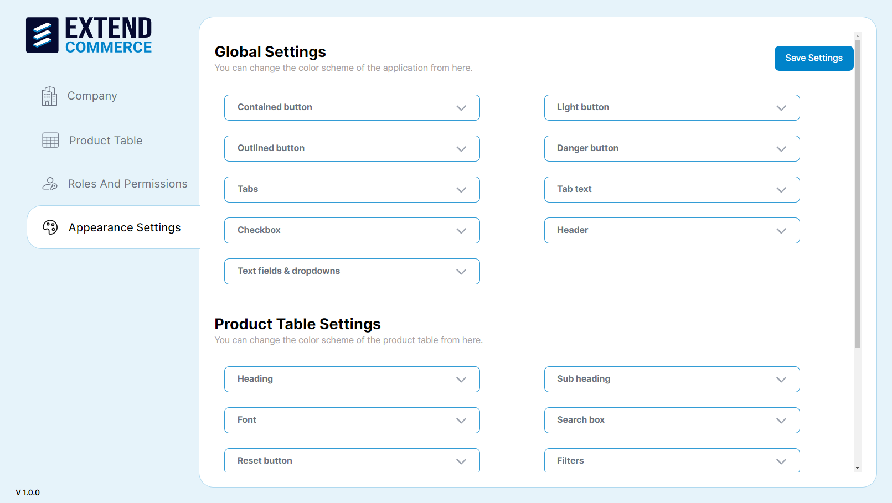
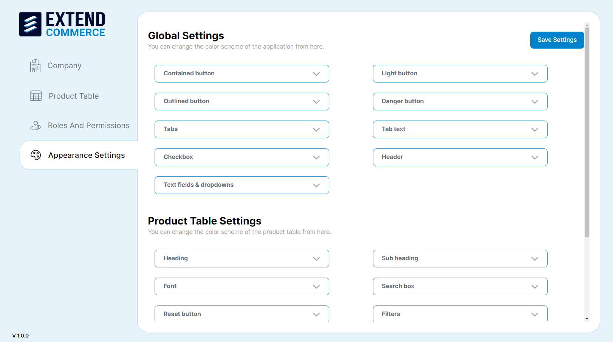

# Appearance Settings

Control the visual appearance of the company dashboard and product tables.

## Customizing Appearance Settings

1. Navigate to the **Appearance Settings** tab in the left sidebar.

2. Customize the global settings and product table settings to align with your branding.

### Global Settings

- Adjust the color scheme for buttons, tabs, checkboxes, text fields, and dropdowns.

### Product Table Settings
- Adjust the color for headings, fonts, subheadings, search boxes, filters, and other elements related to the product table.

3. Click **Save Settings** to apply your changes.
