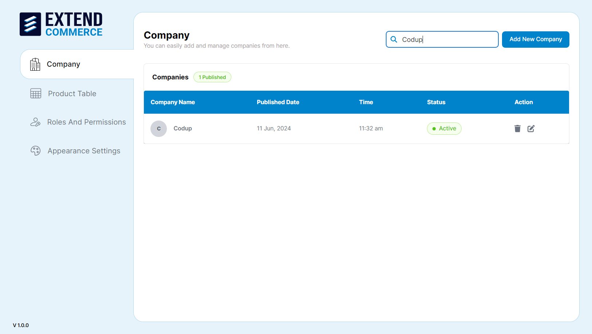
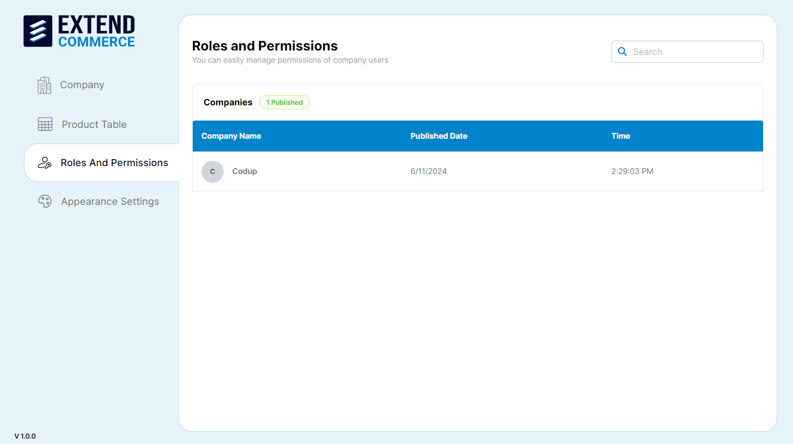
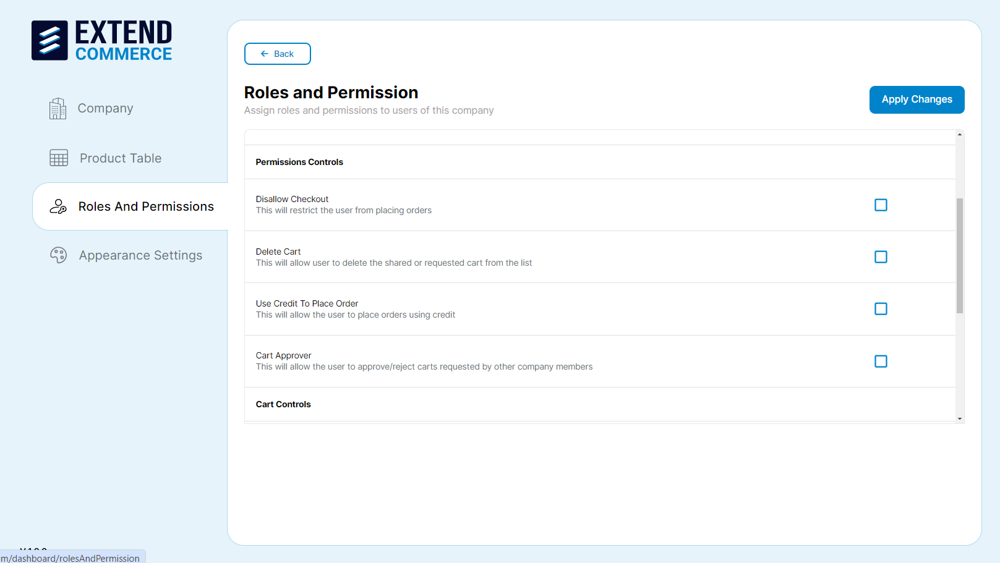

# Getting Started

A guide to install the Extend Commerce app and an overview of the features.

## Prerequisites

To install and use the Extend Commerce application, you need access to the BigCommerce Admin Dashboard, ensuring you have a BigCommerce account and can log into the BigCommerce store to install and manage the application.

## Installation Guide

### Start the Installation
- [Click here to start the installation.](#)
- Ensure you are logged into your BigCommerce store as a Store Admin.

### Access the Marketplace
- In the BigCommerce menu, navigate to `Apps > Marketplace`.

### Search for Extend Commerce
- Use the search bar to find **Extend Commerce**.

### Install the App
- Click **GET THIS APP** and follow the instructions to install the application.

## Post Installation

### Go to your BigCommerce Admin Dashboard
- Navigate to `Apps`.
- You will find the recently installed application.

### Launch the App
- After installation, click to launch the app.
- The app will now be visible in the `My Apps` section.
- Click on the **Extend Commerce** app to open the Application’s Dashboard.

## Application Overview

The dashboard is the main interface where you can access all the features of Extend Commerce. It includes the following sections:

- **Company**: Create and add new companies, manage companies, and view details about each company.
- **Product Table**: Enable functions to add, edit, and manage various Product Tables. Additionally, facilitates the copying of short codes from tables, which can then be pasted into the BigCommerce Web Page Editor, rendering the Product Table on the desired webpage.
- **Appearance Settings**: Customize the appearance of the Product Table from this feature tab.
- **Roles and Permissions**: Define and assign different roles and permissions to the users for different companies.

## Feature Benefits

Extend Commerce offers a variety of features designed to streamline the management of companies and users. Some key benefits include:

- **Company Management & Dashboards**: Manage multiple companies, different dashboards for each company, track order statuses, admins can monitor activities of company features.
- **Product Table Management**: Access and manage the entire product catalog from a single interface, streamline updates, save time, navigate quickly through all products on a single screen, and gain a comprehensive product overview in a single table.
- **User Role Management Permissions**: View orders, view users, delete cart, use credit to place orders, share a cart, load cart, cart approver, disallow checkout, manage purchase limit, cart requester.
- **Company Users Purchasing & Approvals**: Set purchase limits, restrict volumes, fine-tune permissions, implement approval workflows, and manage budgets efficiently for individual users.
- **Customizable Appearance for Product Table**: Enable adjustments to the application's color scheme through global settings (including buttons, tabs, checkboxes, text fields, and dropdowns) and product table-specific settings (such as headings, fonts, subheadings, search boxes, and filters) to achieve a cohesive look.
## Company Management
Create and manage companies, to group customer user accounts.
# Adding a New Company

1. Navigate to the **Company** tab in the right sidebar.
2. Click the **Add New Company** button.

3. Fill in the necessary details such as the company name.
4. Click **Save Company** to add the company.

BigCommerce Admin also has the authority to edit, update, and delete existing companies.

## Editing a Company

1. Select the company from the Company listing page.
2. Click the edit pencil icon in the **Action** column.

3. Update the necessary fields.
4. Click **Save Company** to update the company details.

## Deleting a Company

1. Select the company from the list.
2. Click the trash can icon in the **Action** column.

3. Confirm the deletion in the pop-up dialog.

## Searching for a Company

1. Navigate to the **Company** tab in the left sidebar.
2. Use the search bar located at the top right of the Company page.

3. Enter the company name.
4. The list will be filtered to display matching companies.

**Note:** To create a new company in BigCommerce, go to `Customers → Add Customer` and fill in the Company Name field (optional). When the company name is provided, it will be displayed on the company listing page within the 'Extend Commerce' app.

# User Management

How to create and manage users in companies.

## Creating a New User

1. Navigate to the company name from the company list.
2. Select the **Company Users** tab.

3. Click **Create New User** and fill in the required fields.
4. Enter the user details and click **Save**.

## Adding an Existing User

1. Navigate to the company name from the company list.

2. Select the **Add Existing User** tab.
3. Choose the user from the dropdown list.
4. Assign a reporting person and role.
5. Click **Save** button.

## Editing User Details

1. Navigate to the company name from the company list.
2. Select the user from the list.
3. Click the edit pencil icon in the **Action** column.

4. Update the necessary fields.
5. Click the **Save** button.

## Deleting a User

1. Navigate to the company name from the company list.
2. Select the **Company Users** tab.
3. Click the trash can icon in the **Action** column for the user you wish to delete.

4. Confirm the deletion in the pop-up dialog.

**Note:** To create a new user in BigCommerce, navigate to `Customers → Add Customer`. Enter the customer's details and the company name to associate the customer with that company. The new customer will subsequently appear on the customer listing page within the 'Extend Commerce' app.

**Note:** To register customers on the BigCommerce Store from the Storefront, users must have access to the Storefront link. If the store is not live, they will need the preview code, which can only be shared by the BigCommerce Account Owner.

When creating a customer from the Application, BigCommerce Account Users with access to the BigCommerce Portal can set the password for customers registering to the BigCommerce Store. The password can be set on the Customer Page in the BigCommerce Portal.

# Viewing Orders

1. Navigate to the company name from the company list.

2. Select the **Company Orders** tab.
3. View the list of orders with their statuses. If there are no orders, it will show **No Data**.

# Product Table

Create, edit, delete, and publish custom product tables, anywhere on your storefront.

## Adding a New Product Table

1. Navigate to the **Product Table** tab in the left sidebar.
2. Click the **Add New Table** button.

3. Fill in the necessary details such as the table name and description.
4. Click **Create** to add the product table.

**Note:** Existing tables can contain a short code snippet that can be copied and pasted as a code snippet on a BigCommerce Web Page Editor, rendering the product table on that web page.

## Configuring Product Table Settings

1. Select the product table from the list.
2. Click the settings icon in the **Action** column.
3. Edit Product table saved as a Draft.

4. Adjust the general settings, category & product listing, and columns & filters as needed.
5. Click **Save & Exit** to apply the changes.

Existing tables can be set as **Active** or **Draft**. 

The draft and active status of the table will be based on the catalog of products it contains and the columns the table content has.

## Editing a Product Table

1. Select the product table from the list.
2. Click the pencil icon in the **Action** column.

3. Update the necessary fields.
4. Click **Save & Exit** to update the product table details.

5. Existing tables can be edited.

## Deleting a Product Table

1. Select the product table from the list.
2. Click the trash can icon in the **Action** column.

3. Confirm the deletion in the pop-up dialog.
4. Existing tables can be deleted.

## Searching for a Product Table

1. Navigate to the **Product Table** tab in the left sidebar.
2. Use the search bar located at the top right of the Product Table page.

3. Enter the product table name or part of the name.
4. The list will be filtered to show matching product tables.

# Roles and Permissions

Assign and manage custom roles and permissions to users in companies.

## Managing Permissions

1. Navigate to the **Roles and Permissions** tab in the left sidebar.
2. Select the company from the list.

3. Select **Manage Permissions** adjacent to the user whose permissions you intend to modify.
4. You will be redirected to the Manage Permissions page.

## Permissions Overview

### Dashboard Controls

- **View Orders**: User can view company orders.

### Permissions Controls

- **Disallow Checkout**: This restricts the user from placing orders.

- **Delete Cart**: This will allow the user to delete the shared or requested cart from the list.
- **Use Credit to Place Order**: This allows the user to place orders using credit.
- **Cart Approver**: This allows the user to approve or reject carts requested by other company members.
  **View User**: User can view company members.
  **Note**: Credit limit will be assigned from BigCommerce.

### Cart Controls

- **Manage Purchase Limit**: This allows the user to manage the purchase limits of other company members.
- **Share a Cart**: This allows users to share carts with other company members.
- **Load Cart**: This allows the user to load carts shared by other company members.
- **Cart Requester**: This allows the user to submit carts for approval before placing orders.
- **View User**: User can view company members.

Adjust the permissions as needed by checking or unchecking the boxes next to each permission.

Click **Apply Changes** to save the updated permissions.

# Appearance Settings

Control the visual appearance of the company dashboard and product tables.

## Customizing Appearance Settings

1. Navigate to the **Appearance Settings** tab in the left sidebar.

2. Customize the global settings and product table settings to align with your branding.

### Global Settings

- Adjust the color scheme for buttons, tabs, checkboxes, text fields, and dropdowns.

### Product Table Settings
- Adjust the color for headings, fonts, subheadings, search boxes, filters, and other elements related to the product table.

3. Click **Save Settings** to apply your changes.
