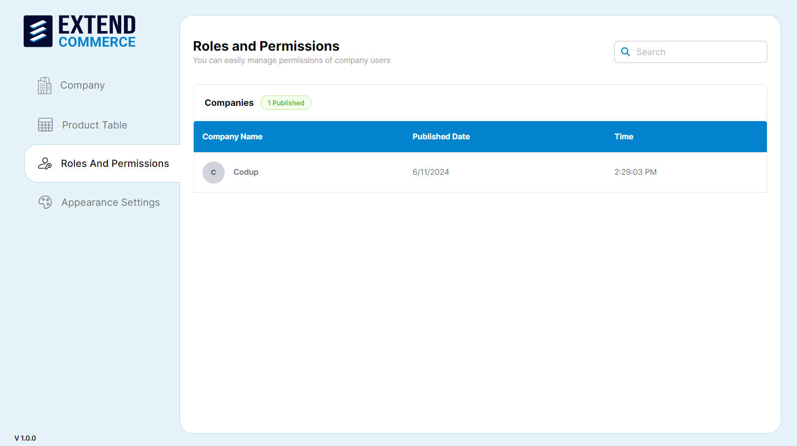
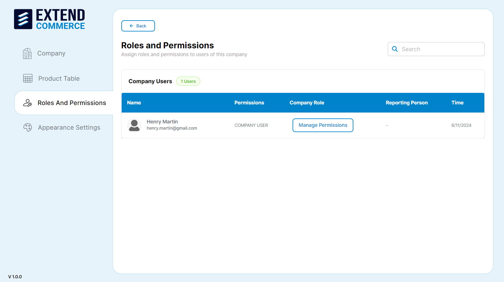
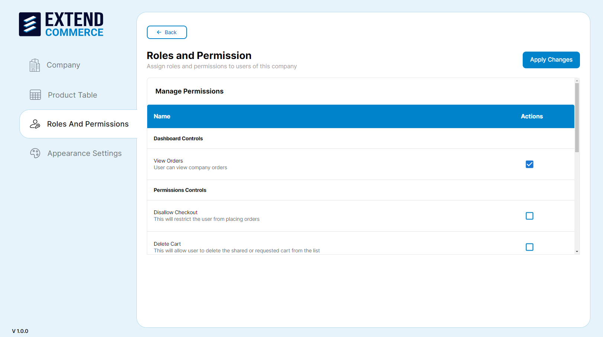
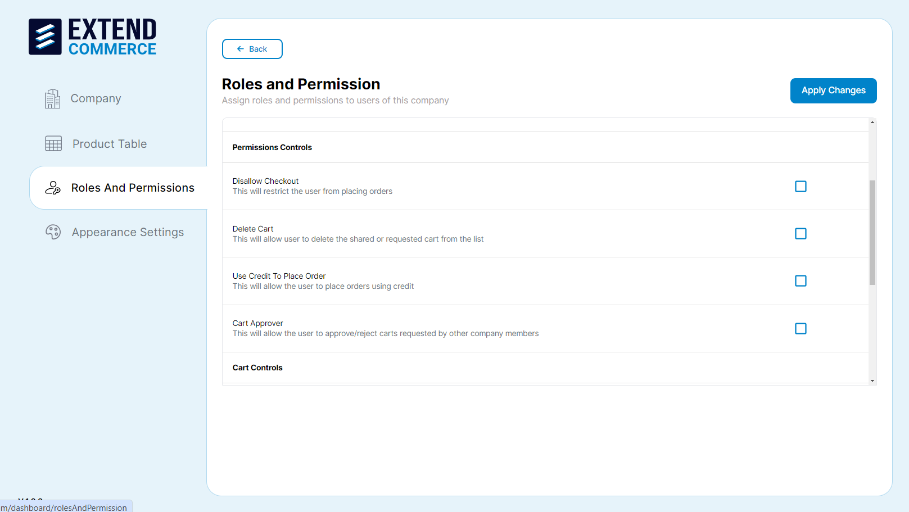
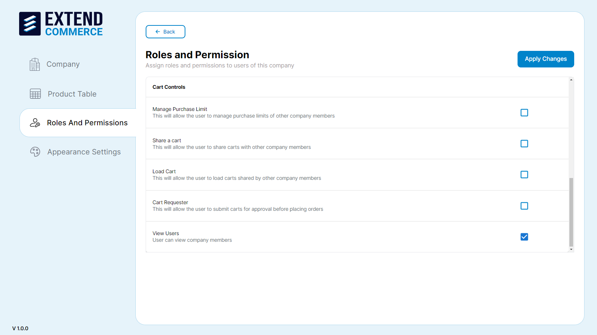
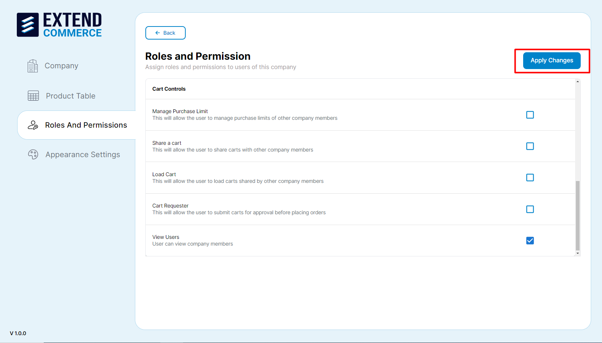

# Roles and Permissions

Assign and manage custom roles and permissions to users in companies.

## Managing Permissions

1. Navigate to the **Roles and Permissions** tab in the left sidebar.
2. Select the company from the list.

3. Select **Manage Permissions** adjacent to the user whose permissions you intend to modify.
4. You will be redirected to the Manage Permissions page.

## Permissions Overview

### Dashboard Controls

- **View Orders**: User can view company orders.

### Permissions Controls

- **Disallow Checkout**: This restricts the user from placing orders.

- **Delete Cart**: This will allow the user to delete the shared or requested cart from the list.
- **Use Credit to Place Order**: This allows the user to place orders using credit.
- **Cart Approver**: This allows the user to approve or reject carts requested by other company members.
  **View User**: User can view company members.
  **Note**: Credit limit will be assigned from BigCommerce.

### Cart Controls

- **Manage Purchase Limit**: This allows the user to manage the purchase limits of other company members.
- **Share a Cart**: This allows users to share carts with other company members.
- **Load Cart**: This allows the user to load carts shared by other company members.
- **Cart Requester**: This allows the user to submit carts for approval before placing orders.
- **View User**: User can view company members.

Adjust the permissions as needed by checking or unchecking the boxes next to each permission.

Click **Apply Changes** to save the updated permissions.