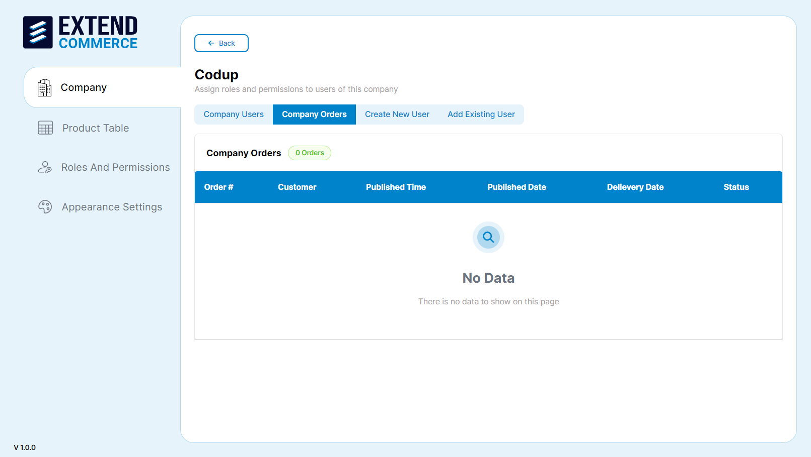

# Viewing Orders

1. Navigate to the company name from the company list.

2. Select the **Company Orders** tab.
3. View the list of orders with their statuses. If there are no orders, it will show **No Data**.
