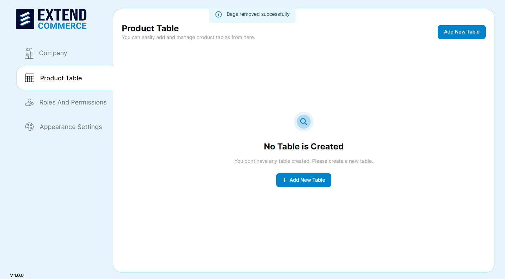
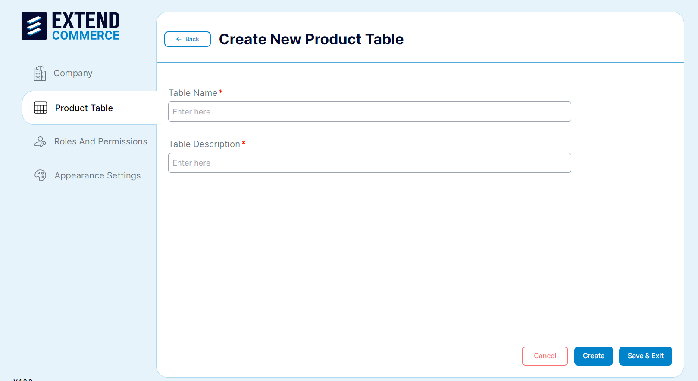
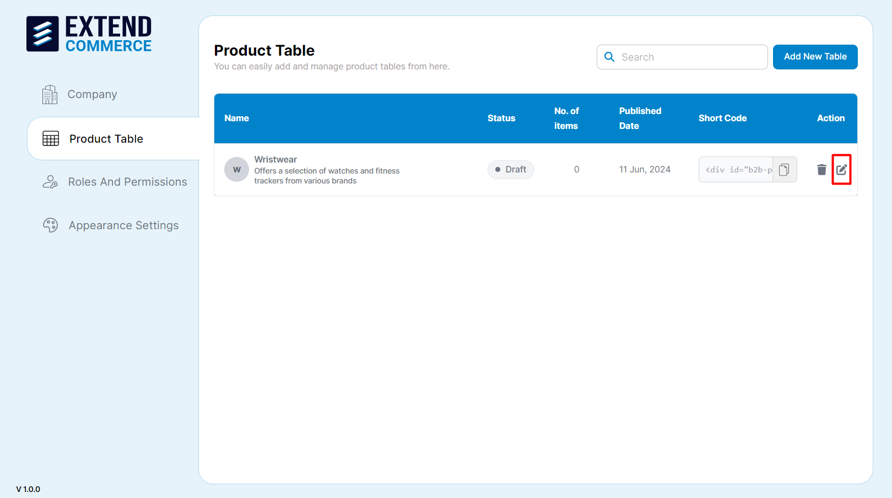
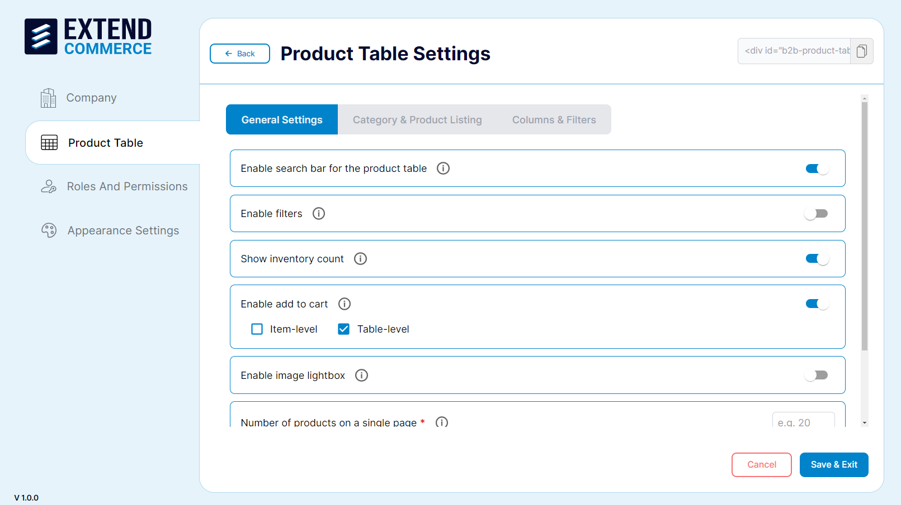
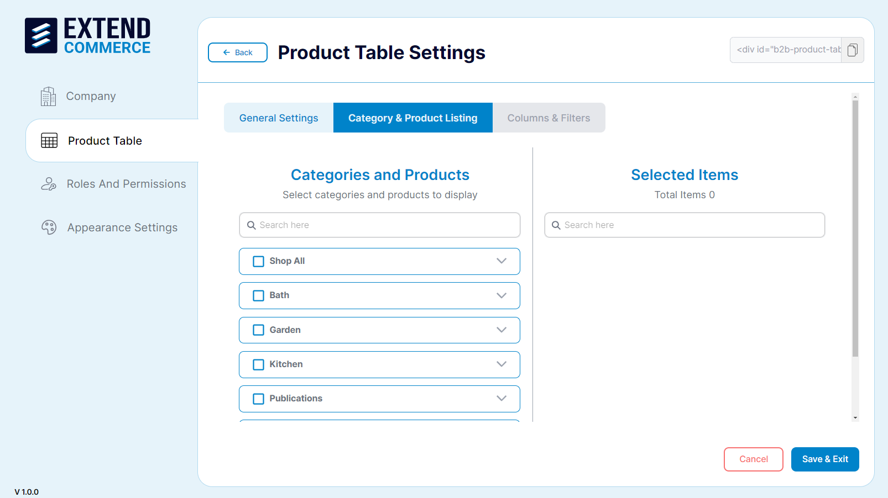
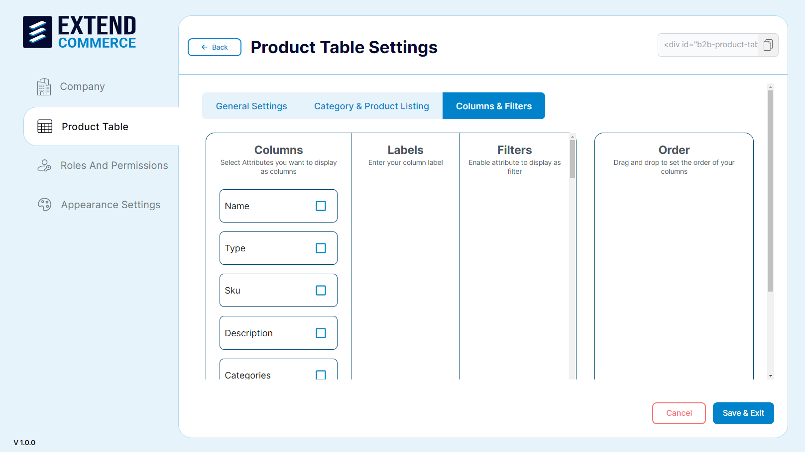
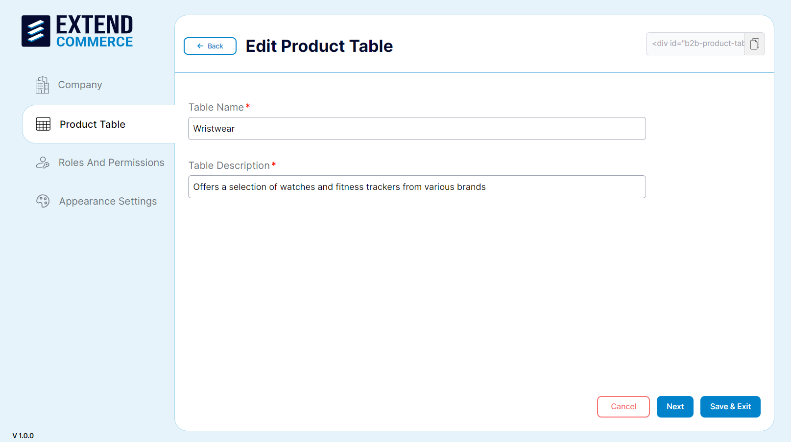
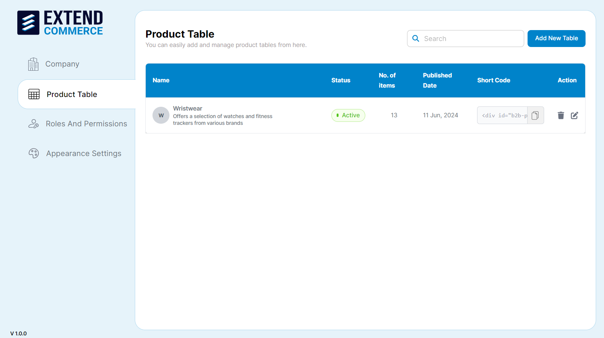
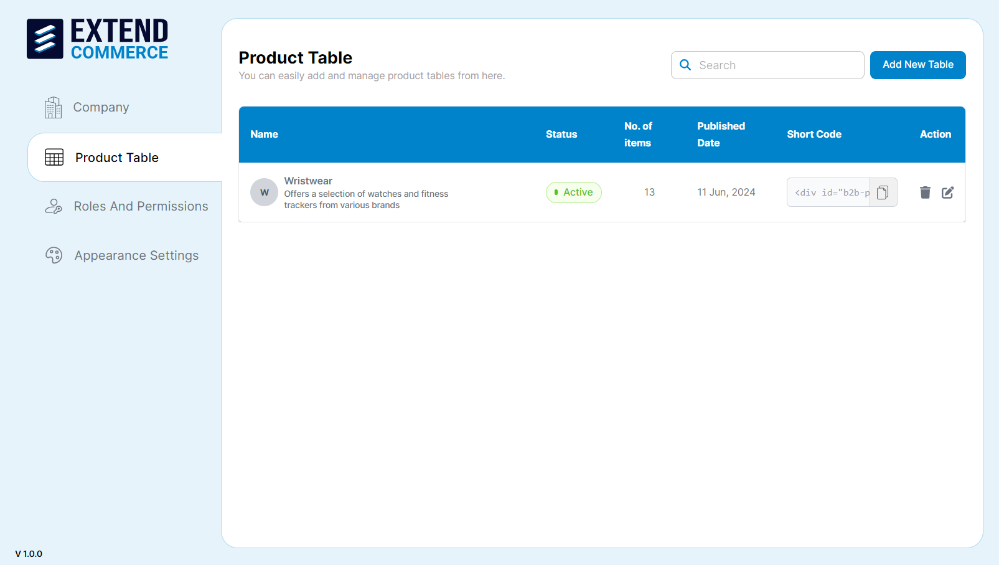
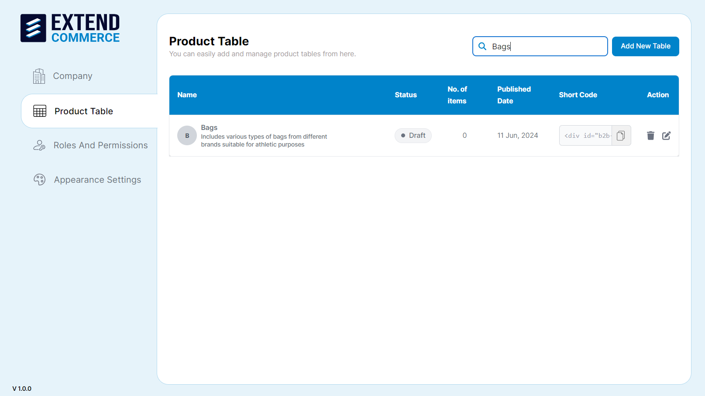

# Product Table

Create, edit, delete, and publish custom product tables, anywhere on your storefront.

## Adding a New Product Table

1. Navigate to the **Product Table** tab in the left sidebar.
2. Click the **Add New Table** button.

3. Fill in the necessary details such as the table name and description.
4. Click **Create** to add the product table.

**Note:** Existing tables can contain a short code snippet that can be copied and pasted as a code snippet on a BigCommerce Web Page Editor, rendering the product table on that web page.

## Configuring Product Table Settings

1. Select the product table from the list.
2. Click the settings icon in the **Action** column.
3. Edit Product table saved as a Draft.

4. Adjust the general settings, category & product listing, and columns & filters as needed.
5. Click **Save & Exit** to apply the changes.

Existing tables can be set as **Active** or **Draft**. 

The draft and active status of the table will be based on the catalog of products it contains and the columns the table content has.

## Editing a Product Table

1. Select the product table from the list.
2. Click the pencil icon in the **Action** column.

3. Update the necessary fields.
4. Click **Save & Exit** to update the product table details.

5. Existing tables can be edited.

## Deleting a Product Table

1. Select the product table from the list.
2. Click the trash can icon in the **Action** column.

3. Confirm the deletion in the pop-up dialog.
4. Existing tables can be deleted.

## Searching for a Product Table

1. Navigate to the **Product Table** tab in the left sidebar.
2. Use the search bar located at the top right of the Product Table page.

3. Enter the product table name or part of the name.
4. The list will be filtered to show matching product tables.
