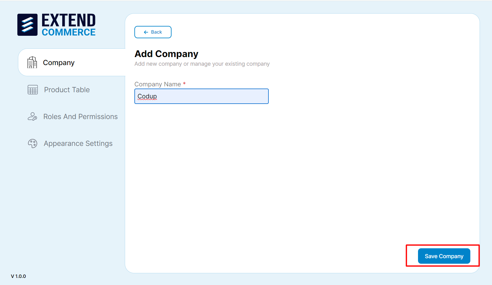
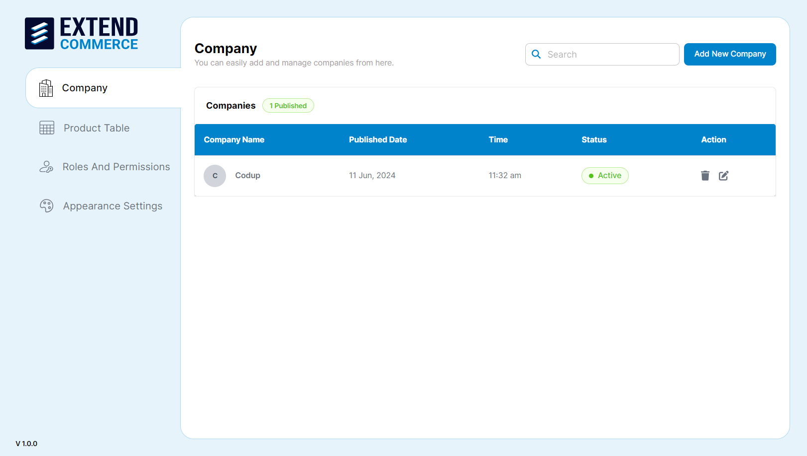
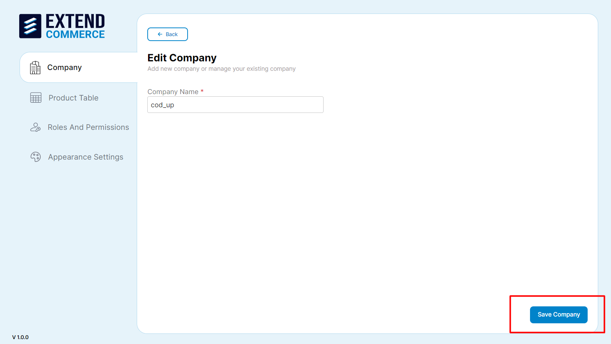
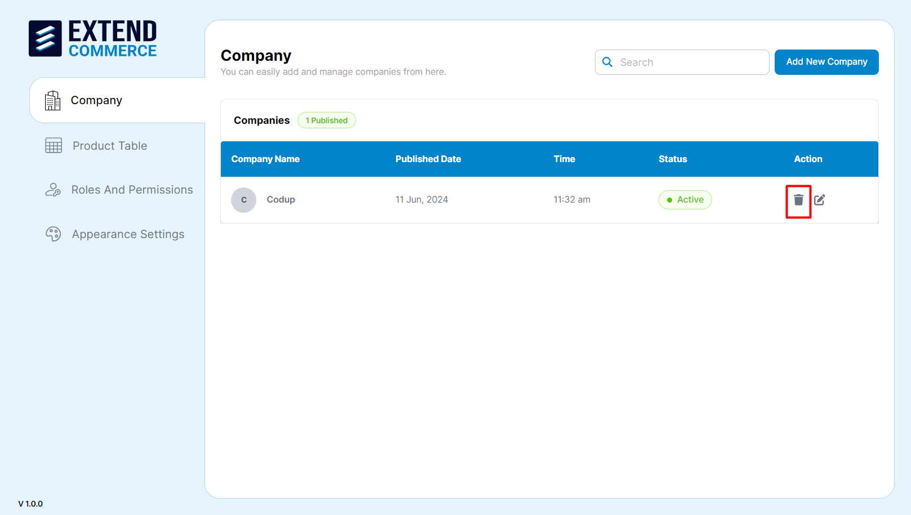
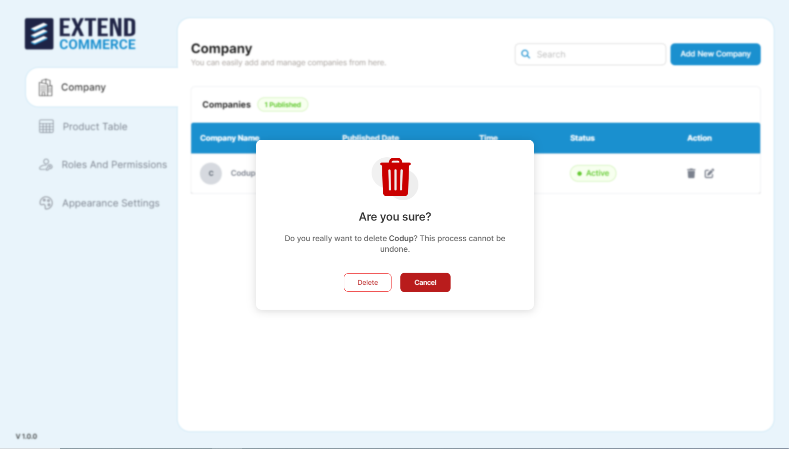
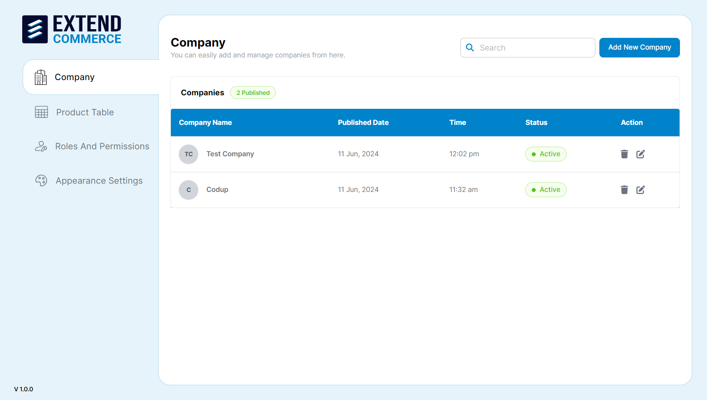
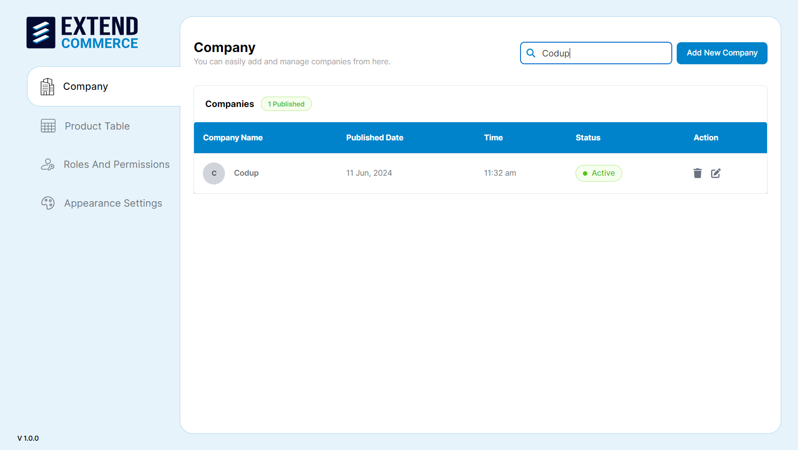

Create and manage companies, to group customer user accounts.
# Adding a New Company

1. Navigate to the **Company** tab in the right sidebar.
2. Click the **Add New Company** button.

3. Fill in the necessary details such as the company name.
4. Click **Save Company** to add the company.

5. BigCommerce Admin also has the authority to edit, update, and delete existing companies.

## Editing a Company

1. Select the company from the Company listing page.
2. Click the edit pencil icon in the **Action** column.

3. Update the necessary fields.
4. Click **Save Company** to update the company details.

## Deleting a Company

1. Select the company from the list.
2. Click the trash can icon in the **Action** column.

3. Confirm the deletion in the pop-up dialog.

## Searching for a Company

1. Navigate to the **Company** tab in the left sidebar.
2. Use the search bar located at the top right of the Company page.

3. Enter the company name.
4. The list will be filtered to display matching companies.

**Note:** To create a new company in BigCommerce, go to `Customers → Add Customer` and fill in the Company Name field (optional). When the company name is provided, it will be displayed on the company listing page within the 'Extend Commerce' app.