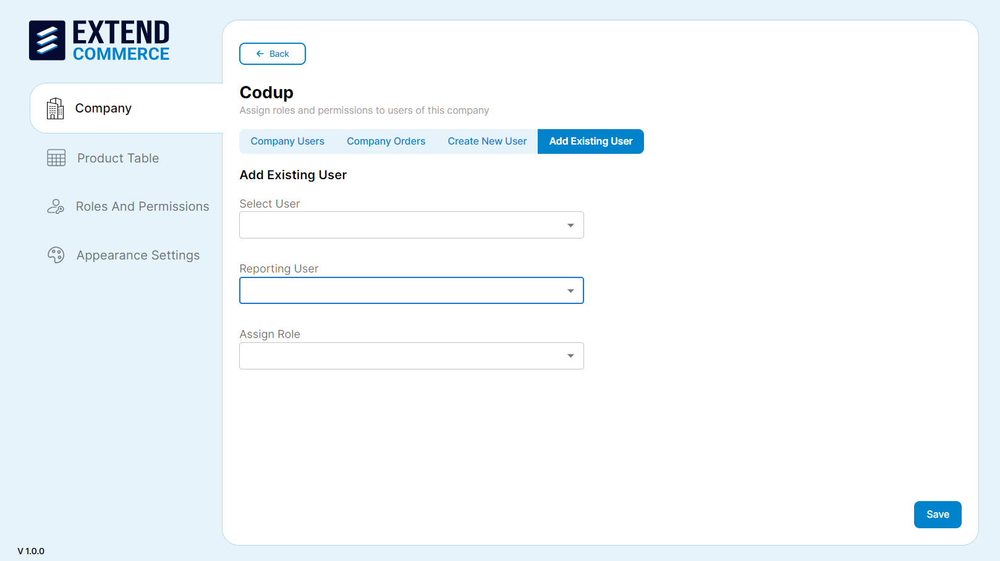

How to create and manage users in companies.

## Creating a New User

1. Navigate to the company name from the company list.
2. Select the **Company Users** tab.

3. Click **Create New User** and fill in the required fields.
4. Enter the user details and click **Save**.

## Adding an Existing User

1. Navigate to the company name from the company list.

2. Select the **Add Existing User** tab.
3. Choose the user from the dropdown list.
4. Assign a reporting person and role.
5. Click **Save** button.

## Editing User Details

1. Navigate to the company name from the company list.
2. Select the user from the list.
3. Click the edit pencil icon in the **Action** column.

4. Update the necessary fields.
5. Click the **Save** button.

## Deleting a User

1. Navigate to the company name from the company list.
2. Select the **Company Users** tab.
3. Click the trash can icon in the **Action** column for the user you wish to delete.

4. Confirm the deletion in the pop-up dialog.

**Note:** To create a new user in BigCommerce, navigate to `Customers → Add Customer`. Enter the customer's details and the company name to associate the customer with that company. The new customer will subsequently appear on the customer listing page within the 'Extend Commerce' app.

**Note:** To register customers on the BigCommerce Store from the Storefront, users must have access to the Storefront link. If the store is not live, they will need the preview code, which can only be shared by the BigCommerce Account Owner.

When creating a customer from the Application, BigCommerce Account Users with access to the BigCommerce Portal can set the password for customers registering to the BigCommerce Store. The password can be set on the Customer Page in the BigCommerce Portal.