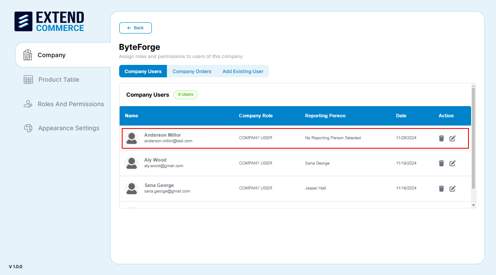
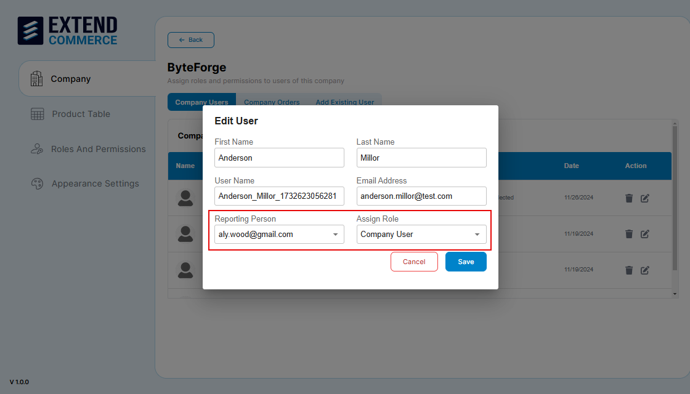

How to create and manage users in companies.

## Adding Users to a Company
Our app synchronizes users from BigCommerce Customers. To ensure proper setup, follow the steps below:

### Method 1: Adding a New User

1. **Create a New User in BigCommerce:**  
   - Navigate to your BigCommerce admin panel and  Click **Customers** section 
   
   - Click **Add Customer** 
   - Fill in the required fields, including **Company Name**.  
   

>**Tip:**
> Ensure the Company Name matches the company name created in the Extend Commerce app.  

2. **Return to the Extend Commerce App:**  
   - Locate the company you created in the app.  
      
   - The newly added user will be listed under the selected company.
      

3. **Assign a Role:**  
- Newly added users will not have a role initially.
- Click the Edit icon next to the user’s name.
  
- In the Edit Information form:
   - Assign a Role to the user.
   - Assign a Reporting Person to establish their reporting hierarchy

## Method 2: Adding Existing Users

If you already have users in BigCommerce who aren't linked to any company:  

1. **Add Existing Users:**  
   - Go to the Extend Commerce app.  
   - Click the company where you want to add users.  
   - Click **Add Existing Users** to display a list of users not yet assigned to a company.  
   

2. **Assign Users to the Company:**  
    a. Select the users from the list to add them to the company.  
    b. Add a **Reporting User** for each assigned user (if applicable).  
    c. Assign a Role to define their permissions and responsibilities.  
   

## Editing User Details

1. Navigate to the company name from the company list.
2. Select the user from the list.
3. Click the edit icon in the **Action** column.
  
4. Update the necessary fields.
5. Click the **Save** button.

## Deleting a User

1. Navigate to the company name from the company list.
2. Select the **Company Users** tab.
3. Click the trash can icon in the **Action** column for the user you wish to delete.

4. Confirm the deletion in the pop-up dialog.

**Note:** To register customers on the BigCommerce Store from the Storefront, users must have access to the Storefront link. If the store is not live, they will need the preview code, which can only be shared by the BigCommerce Account Owner.

When a user created in the Extend Commerce app wants to access the storefront. They should use the email and password that were set during their creation in BigCommerce.