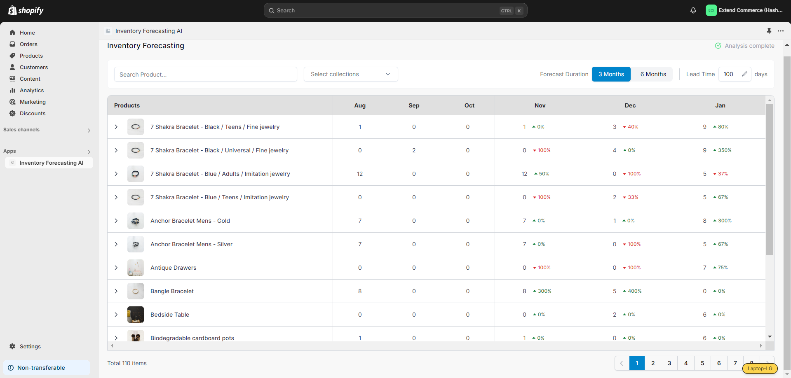

Our Inventory Forecast AI app is designed to help businesses accurately predict future sales and optimize their inventory accordingly using a forecasting algorithm.For better sales forecasting, we recommend using 24 months of data. Offering both 3-month and 6-month forecast options, the app provides detailed insights into past sales trends and performance. For upcoming months, users can anticipate potential sales fluctuations and receive timely restocking recommendations based on lead time.

## Install Inventory Forecast AI App

Once installed, our forecasting algorithm will begin analyzing your Shopify order data to generate sales forecasts. There are four possible statuses that you’ll see:

* **Idle**: The data is being downloaded from your store, but the analysis hasn’t started yet.
  

* **In Progress**: The sales analysis is underway.
  

* **Complete**: The analysis has finished, and forecasts are ready.
  

* **Error**: The model failed to predict sales due to some issue.
  

The time required for analysis depends on the volume of data in your store. Once completed, you’ll receive an email notification.

## Review Forecasts and Analytics

After receiving the completion email, return to the Inventory Forecast AI app to view the results.

* **Sales Data**: For each product, the table will display sales for the previous months as well as forecasted sales for the upcoming months.
  

* **Indicators**: Each forecasted month will include an indicator to show projected sales changes:

  * **Green**: Indicates an increase in sales.

  * **Red**: Indicates a decrease in sales.
    

## Toggle Between 3-Month and 6-Month Forecasts

You can always switch between 3-month and 6-month forecasts, and the table will automatically update to display the corresponding sales data.

## Input Lead Time

Enter the lead time for restocking. This is the number of days it takes to order a product from your vendor and receive it into your inventory.

Accurate lead time input is essential for generating timely and precise restocking recommendations.

## Product-Specific Analytics

Each product section is displayed in an accordion format. Clicking on a product will expand its sections, showing:

* **Sales Graph**: A visual representation of past sales trends alongside future sales projections.
  

* **Restock Table**: A table that shows calculated inventory levels based on current inventory and predicted sales and provides a recommended restock date based on your lead time input.
  

**Note**: Restocking recommendations are only available for products whose inventory is being tracked in Shopify.

## Adjust Lead Time

You can modify the lead time at any point. The stock level table will update automatically to reflect the new lead time and adjust the suggested restocking dates accordingly.

## Search and Filter Options

* **Product Search**: Use the search bar to filter products, making it easier to find specific items in the table.
  

* **Filter by Collection**: Use the dropdown menu to view products by collections you’ve created in your Shopify store. This allows for a more focused view of sales forecasts and stock levels for a particular product collection.
  