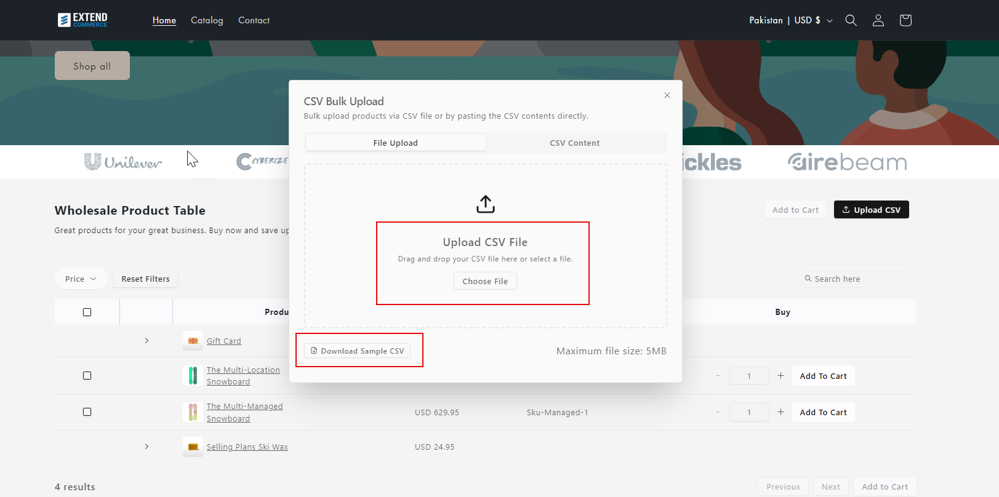

The Quick Order app simplifies bulk purchasing by allowing your customers to upload products directly to their carts using a CSV file or by pasting CSV content. This guide explains how to use the CSV upload feature effectively.

---

## Using the CSV Upload Feature

Once enabled, a **"Upload CSV"** button will be visible on your store’s product table.  
  

Clicking the button opens a dialog box with two options:  

1. **File Upload**  
2. **CSV Paste**  

---

### 1. File Upload

- Drag and drop your CSV file or select it from your computer.
- A template is provided where you can enter SKUs and quantities. Products with matching SKUs in the product table will be added to the cart.  
  

- Ensure your CSV file contains two columns: SKU and Quantity.
  

- Once the CSV file is successfully uploaded without any errors, you will be directed to an intermediary screen where you can select the items you wish to add to your cart.  
  
  
- If there are errors in the file, you’ll see a notification at the top listing errors and their line numbers. A downloadable error report is also available.  
  

---

### 2. CSV Content Paste

- Use the text box to paste CSV content directly (formatted as SKU, Quantity, e.g., `TSL-LM-A101, 9`).  
  

- Click **Validate Content** to check the entries. If all SKUs and quantities are valid, you’ll proceed to a screen where you can choose which items to add to the cart.  
  

- Once the CSV content is successfully validated without any errors, you will be directed to an intermediary screen where you can select the items you wish to add to your cart.  
  

- If issues with SKUs are detected (e.g., missing SKUs), an error message and downloadable error report will be provided.  
  

> **Tip:**  
> The maximum allowed size for the CSV file is 5 MB.

---