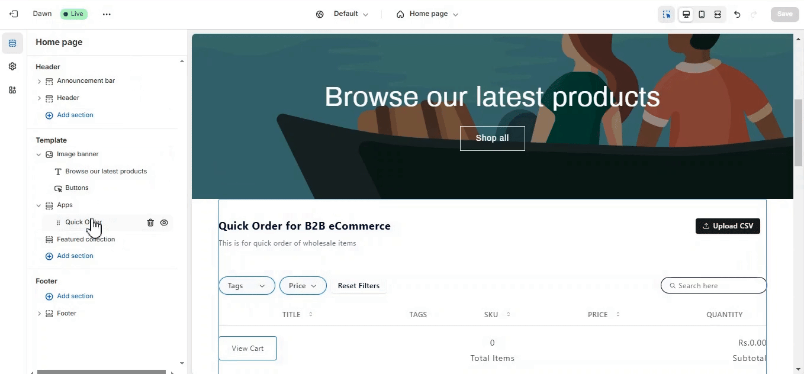

# Customizing Thumbnails in Quick Order

You can now customize the CSS for the product thumbnails that appear in **Quick Order** or the **Product Table** on your store. Here's how to do it:

## Steps to Customize Thumbnails:

1. **Click** on **Online Store** in your Shopify Admin.
2. In your theme settings, select the theme currently active on your store and click **“Customize”**.
  
3. Once inside the theme customizer, **add the app**—either **Quick Order** or **Product Table**—depending on which suits your business needs.
  
  
4. **Click on the app** within the customizer, and you’ll see a **Custom CSS box** available.
5. **Input your custom CSS** for the product thumbnails. The class for the thumbnails is `.ec__thumbnail`. Below is an example of the format in which you can write your CSS:

```css
.ec__thumbnail {
    width: 200px;
    height: 100px;
    padding: 2px;
}
```

6. The changes will be immediately visible in the theme customizer, allowing you to preview the adjustments in real-time.
  
7. Once satisfied with the changes, click Save to apply the updates to your store.


Once you add your custom CSS, the product thumbnails in Quick Order or Product Table will reflect your style preferences.