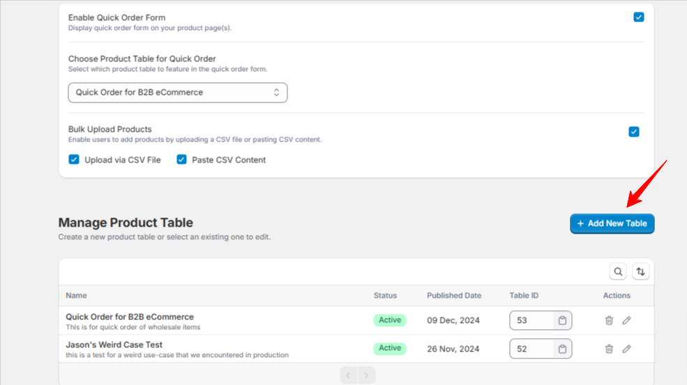
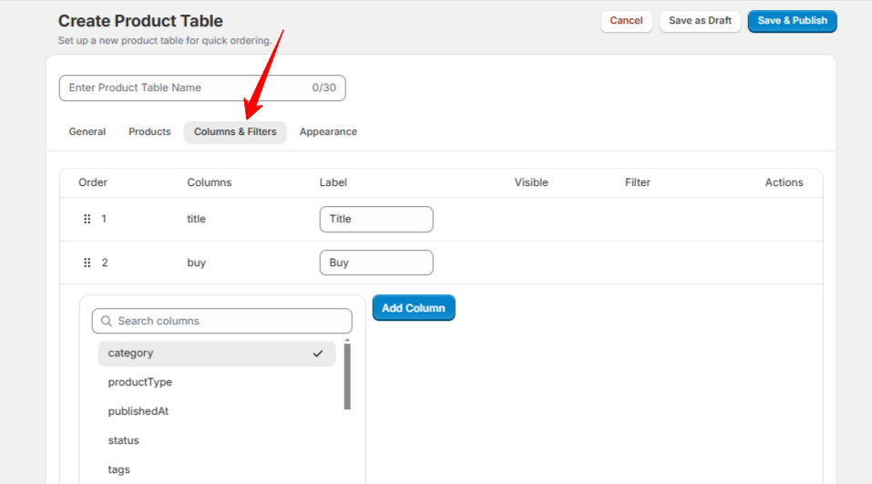
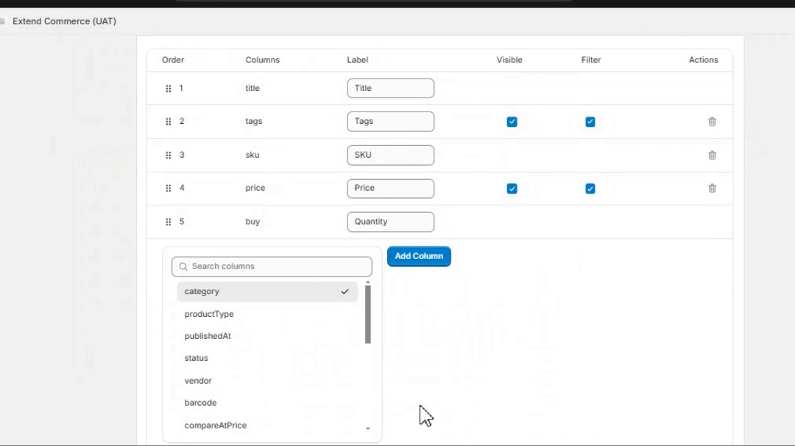
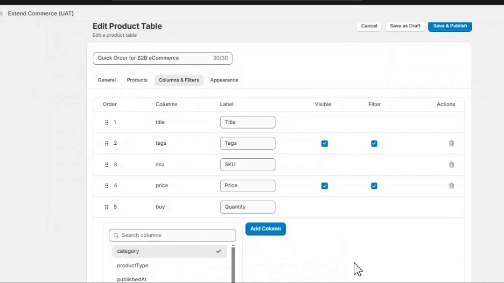

With Quick Order, you can seamlessly integrate product and variant metafields into your order tables, enhancing functionality and customization.  

## **Prerequisites**  
Before you get started, ensure the following:  
1. **Metafields Setup**: You’ve created the required [metafields](https://help.shopify.com/en/manual/custom-data/metafields) for **Products** or **Variants** in your Shopify admin.  
2. **Assigned Values**: The metafields have been assigned specific values for the relevant products or variants.  

## **Step-by-Step Guide**  

### **1. Add a New Table**  
- Navigate to the **Admin Panel** of the Quick Order app.  
- Click the **“Add New Table”** button.  

- You’ll be directed to the **Table Settings** page.  

### **2. Configure Columns and Filters**  
- Scroll to the **“Columns and Filters”** section.  

- Towards the end, you’ll find a list of all available metafields in your system.  
- Select the metafields you want to display as columns in your table.  

### **3. Understand Your Metafields**  
- Use the **“Definition”** icon next to each metafield to view a brief description of its purpose and details.  

### **4. Save and Publish**  
- Once you’ve configured the metafields and other table settings, click **“Save and Publish”**.  
  

- Return to the **Quick Order Settings** page and select the newly created table from the **Choose Product Table for Quick Order** dropdown field and click **Save Settings**

### **5. View Your Metafields in Quick Order**  
- Log in to your store and access the Quick Order page.  
- The metafields you selected will now appear as columns in the table.  

---