This guide will help you set up, manage, and customize product tables for your store. Whether you want to use product tables outside of the Quick Order flow or just need a table to add products to your cart quickly, you can easily manage these tables within our application.

## How to Add a Product Table

### 1. Access Product Table Management

* Go to the **Manage Product Tables** section of your application.

* Click **Add Product Table** to navigate to the **Product Table Configuration** screen.
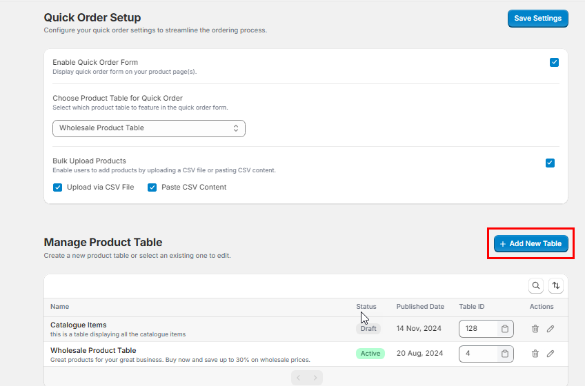

### 2. Customize Your Product Table

Once on the **Product Table Settings** page:

- **Table Name**: Provide a name for your product table.
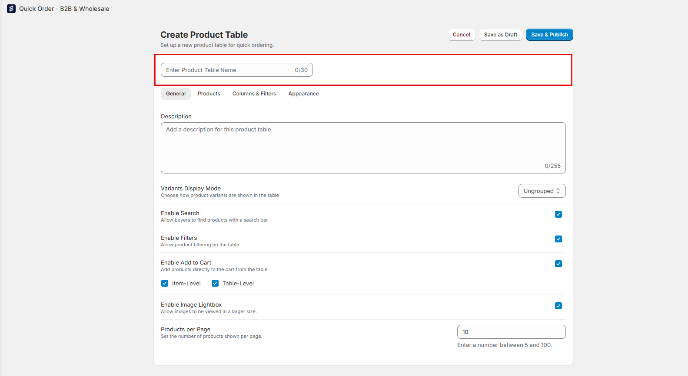

- You can further customize your product table using the following tabs:

### a. **General Settings**

- **Description**: Enter a brief description of the table’s purpose.
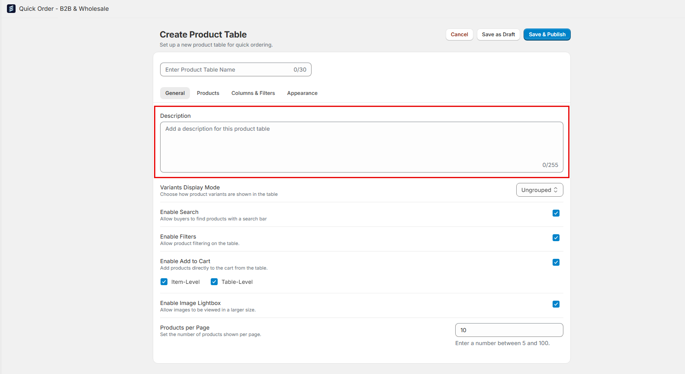

- **Variants Display Mode**: Choose how variants will display:
  - **Ungrouped**: All variants are displayed as separate items.
  - **Grouped**: A variant selection column is added, allowing customers to choose and add specific variants to their cart.
  - **Folded**: Variants are hidden under a parent product until clicked, displaying variants in an accordion-style view.

  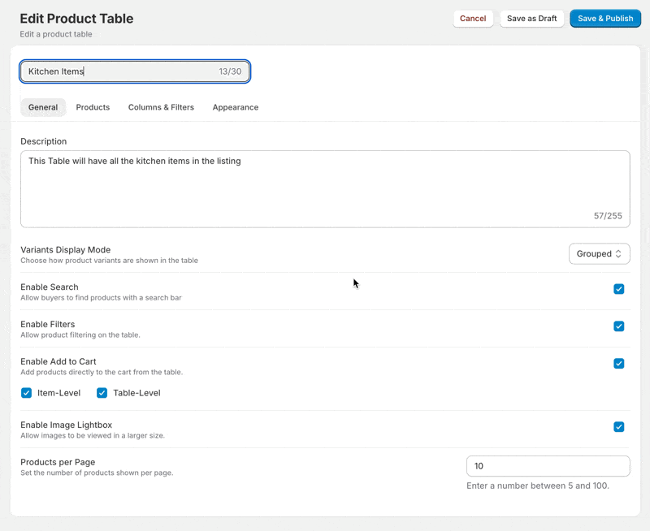

- **Enable Search**: Allows customers to search for products within the table.

- **Enable Filters**: Provides customers with filter options for more intuitive browsing.

- **Enable Add to Cart**: Choose whether to enable “Add to Cart” functionality at the item level, table level, or both (enabled by default).

- **Enable Image Lightbox**: Enable image lightbox for larger image views.

- **Products per Page**: Define the number of products to display per page.

### b. **Products Tab**

- **Display Product Selection**: Choose whether to display all products or only specific collections.
- **Selected Collections**: If opting for specific products, choose collections from a dropdown menu.

- **Preview Products**: Click the eye icon to preview products within each collection.
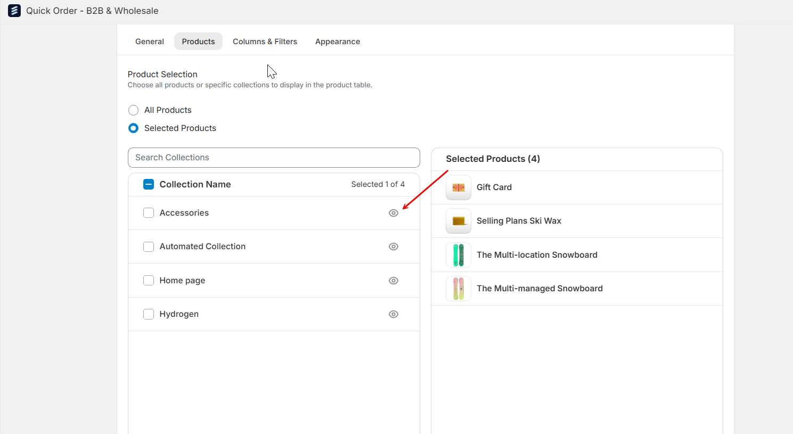

### c. **Columns & Filters**

- **Available Columns**: Select which columns to display from available product attributes, such as:
  - Product Type, Status, Tags, Vendor, Barcode, Compare at Price, Price, SKU, Published At, Category, Inventory Quantity, Tax Code, Taxable.
  
- **Label and Filters**: Enter a label name that will be displayed for the column in the table, and check the box under "Filters" to enable filtering based on that column’s values.
  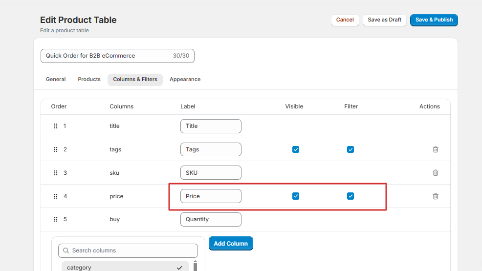
- **Column Management**: Rearrange columns by dragging them into your preferred order, and delete unnecessary columns. Note that the "Title" column is pre-selected and mandatory.
  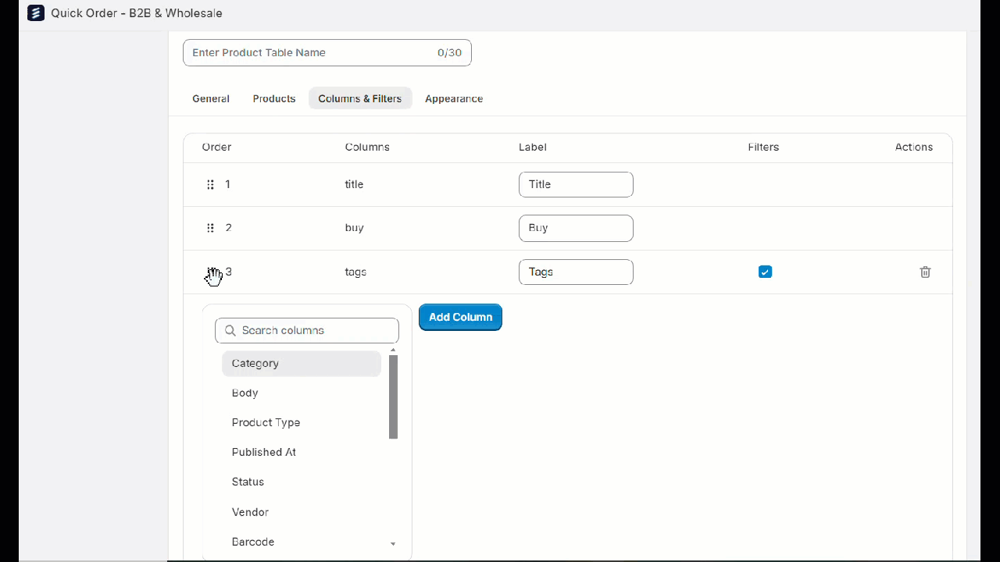

### d. **Appearance**

- **Color Palette**: Choose colors for table elements like headings, buttons, and fonts.
- **Save Palette**: Save your customized palette; all elements will update to match.
- **Restore Default**: Reset to the default color palette if needed.
  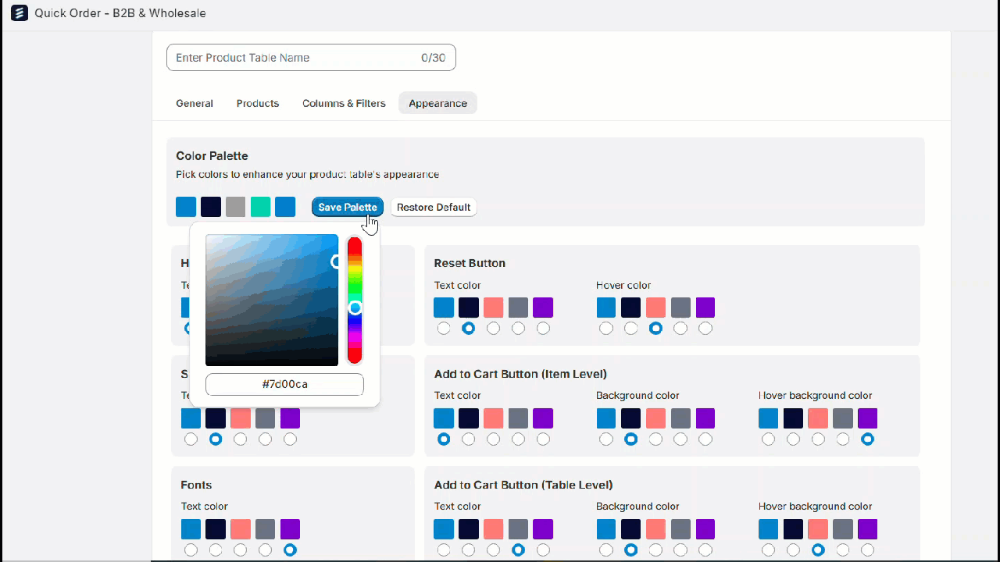

## 4. **Save Settings**

- **Save & Publish**: Sets the product table to Active status, allowing it to be added to any part of your store outside of Quick Order if needed. The table will be fully accessible within your store.
- **Save as Draft**: Sets the product table to Draft status, making it unavailable for standalone use on the store until published.
  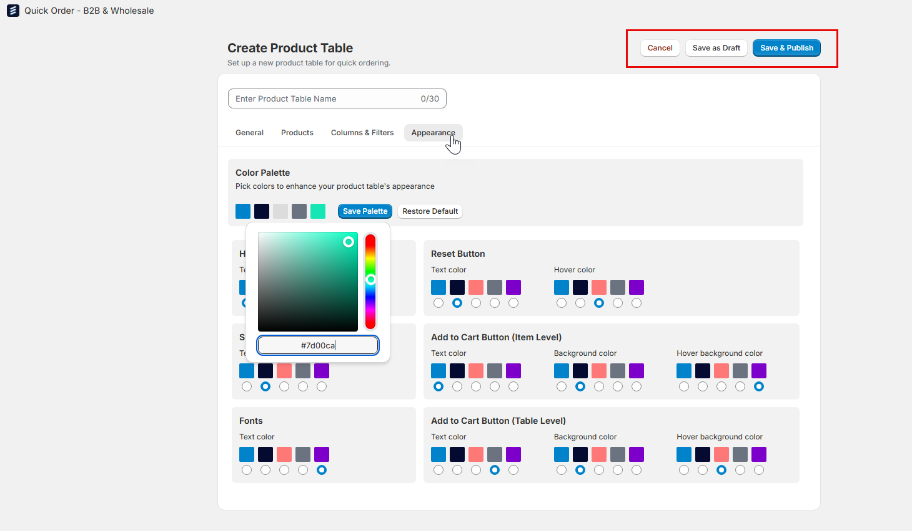

## How to Embed a Product Table in Your Store

You can easily embed your product table anywhere in your store by adding its unique Product Table ID in your theme customization settings.

### 1. Locate Product ID
* You can find the **unique Product ID** for each product listed in the **Manage Product Tables** section. This ID is displayed alongside other product details and serves as a unique identifier for each product in the system.

### 2. Access Theme Customization

* Navigate to your store's **Theme Customization** section.
  

### 3. Add the Product Table App Block

* Under the **App** section, click **Add New Block** and select the **Product Table App** block.
  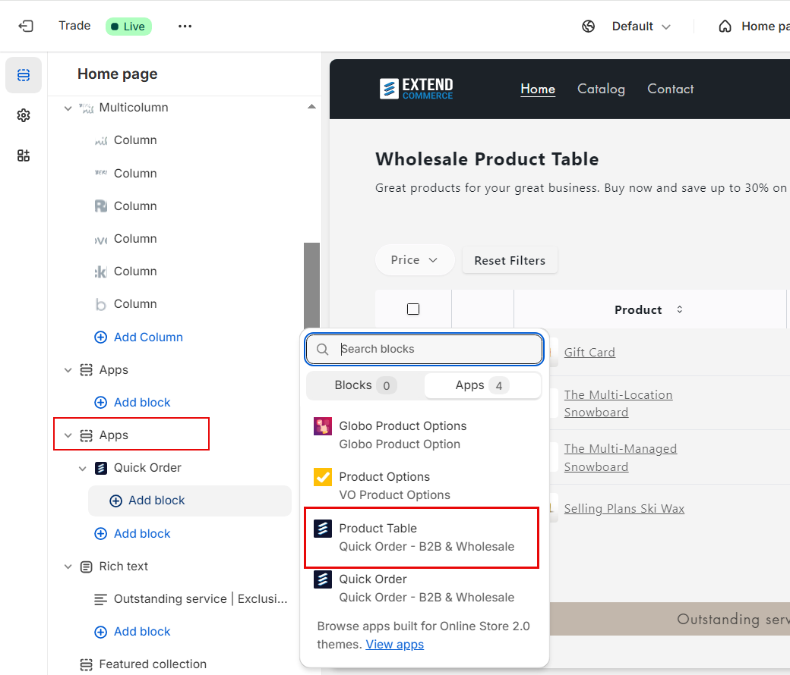

### 4. Paste the Product Table ID

* Click on the newly added **Product Table App** block.

* Paste the unique Product Table ID you copied in **Step 1** into the field shown and the Product Table will instantly be populated on the page.
  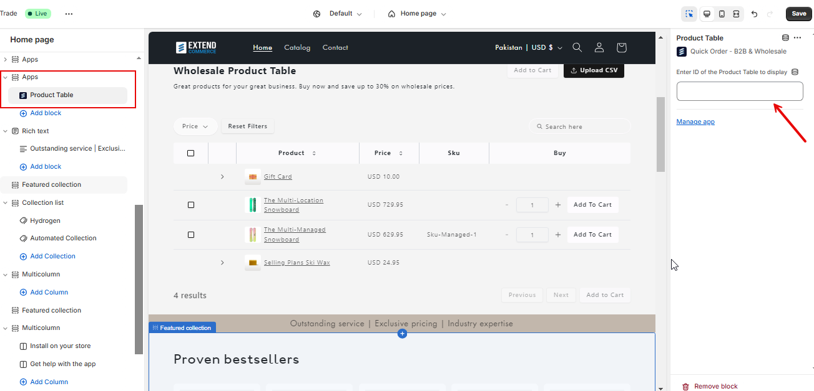

### 5. Save Your Changes

* Click **Save** to apply the changes to your store’s theme.
  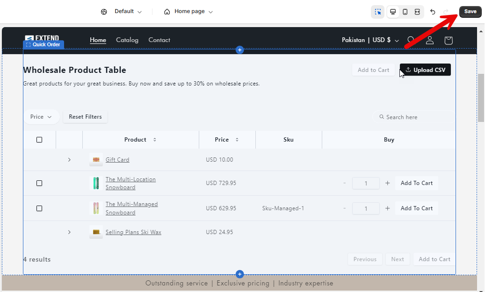

### 6. Product Table Display in Your Store

* Once configured, the product table will appear in your store with the settings you’ve selected, including search options, filters, columns, and any variants you've set up earlier.
  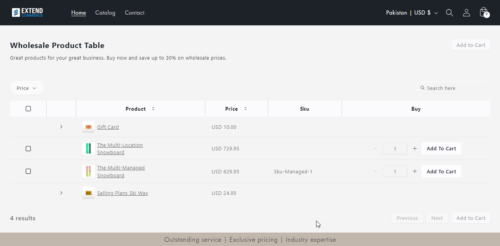

## How to Edit or Delete a Product Table

### Edit Product Table

1. Go to the **Manage Product Tables** section.

2. Find the table you want to edit and click the **Edit** icon under **Actions**.
  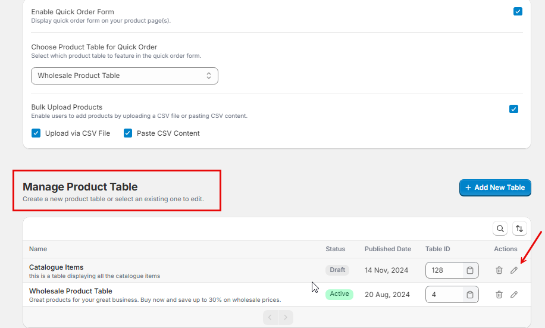

3. You will be taken to the Product Table Configuration screen, where you can make changes.
  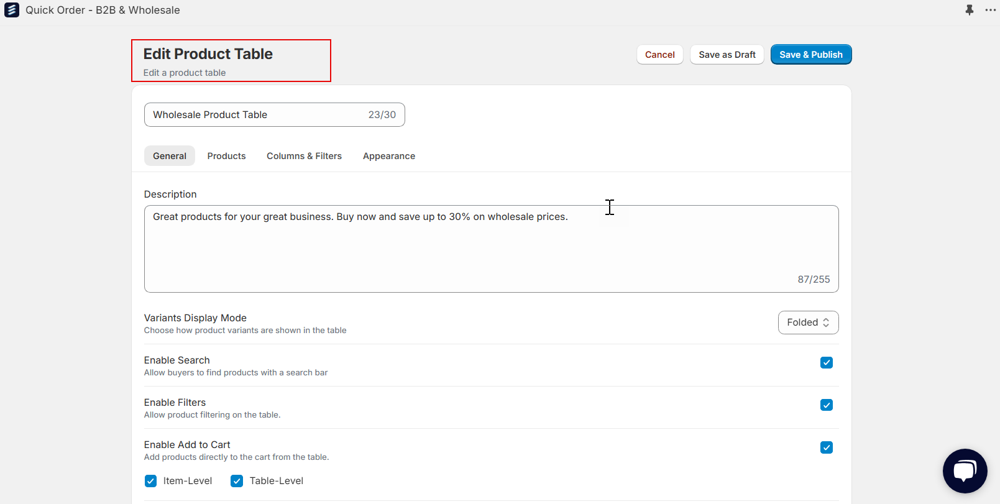

### Delete Product Table

1. In the **Manage Product Tables** section, find the table you want to delete.

2. Click the **Delete** icon under **Actions**.
  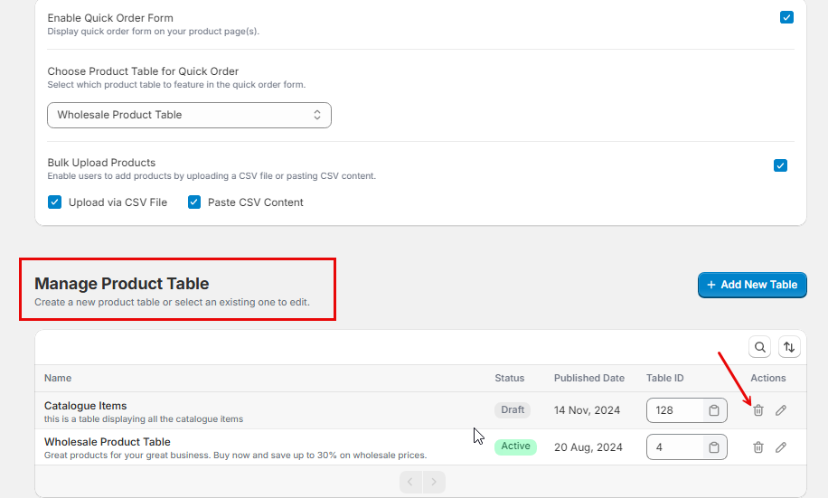

3. Confirm the deletion when prompted. Please note that once deleted, this action cannot be undone.
  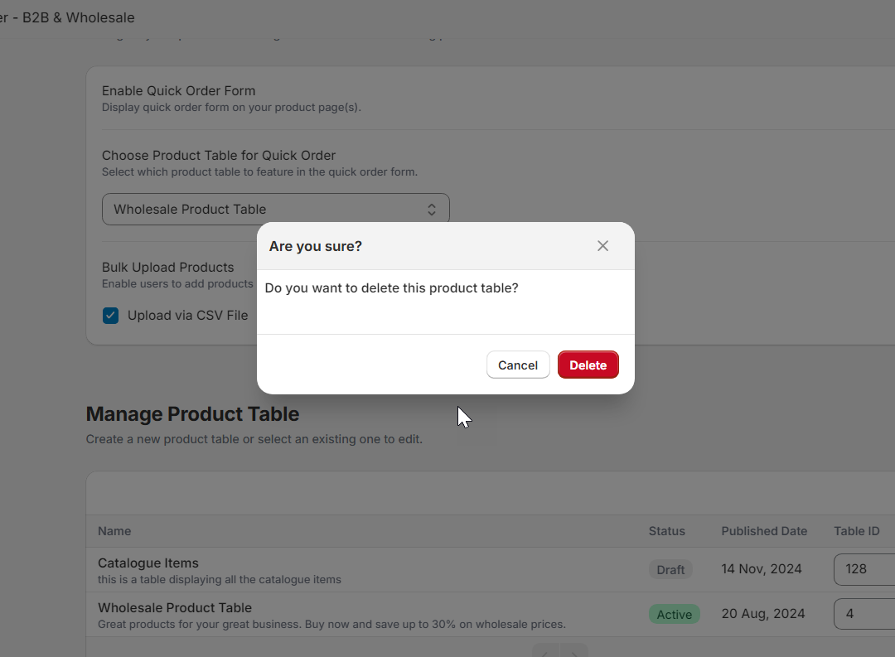

### Searching and Sorting 
1. **Search Functionality**  
   You can easily search for products within the management screen. The search results will be displayed dynamically as you type, providing quick and relevant matches based on your query.
   

2. **Sorting Options**  
   The product table can be sorted based on the following criteria:
   
   - **Name**: Sort the products alphabetically in either:
     - **Ascending Order** (A-Z)
     - **Descending Order** (Z-A)

   - **Published Date**: Sort the products by their published date in either:
     - **Newest First** (most recent publication date)
     - **Oldest First** (earliest publication date)
     

By following these steps, you can quickly add, edit, or embed a product table in your store, making it easier for customers to browse and purchase products. If you need further assistance, feel free to reach out to our support team.