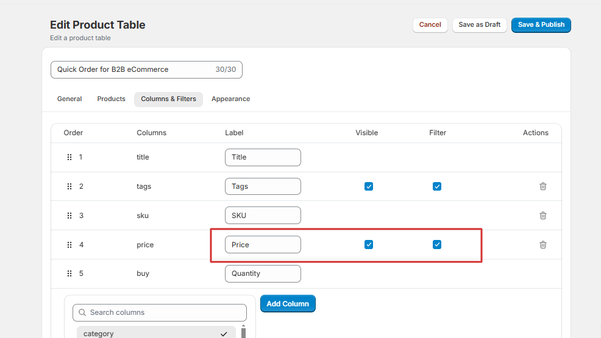

This guide walks you through setting up the Quick Order feature for bulk purchasing. With customizable product tables and [CSV uploads](https://docs.extendcommerce.com/quick-order/Bulk_Upload_via_CSV), customers can easily add products to their cart. Additionally, Quick Order supports [Catalog Pricing](https://docs.extendcommerce.com/quick-order/Catalog_Pricing_Integration), [Metafields Integration](https://docs.extendcommerce.com/quick-order/MetaFields_Integration), and [Custom CSS](https://docs.extendcommerce.com/quick-order/Customizing_Thumbnails) for thumbnails. Follow the steps below to get started:

## 1. **Enable Quick Order**

- Check this box to activate the Quick Order feature on your store. By default, this option is enabled. If you uncheck it, the following settings will be disabled.

## 2. **Choose Product Table for Quick Order**

- Click **Create Product Table** to navigate to the Product Table Settings page and set up a new table.

## 3. **Setting Up Product Table for Quick Order**

Once on the **Product Table Settings** page:

- **Table Name**: Provide a name for your product table.

- You can further customize your product table using the following tabs:

### i. **General Settings**

a. **Description**: Enter a brief description of the table’s purpose. 
b. **Variants Display Mode**: Choose how variants will display:
  - **Ungrouped**: All variants are displayed as separate items.
  - **Grouped**: A variant selection column is added, allowing customers to choose and add specific variants to their cart.
  - **Folded**: Variants are hidden under a parent product until clicked, displaying variants in an accordion-style view. 
c. **Enable Search**: Allows customers to search for products within the table. 
d. **Enable Filters**: Provides customers with filter options for more intuitive browsing. 
e. **Enable Buying**: Check this box to allow adding products to the cart. This unlocks the **Buying Experience** option with two modes:  
  - **Cart Button**: Adds an "Add to Cart" button. Choose placement at the item, table, or both levels.
  - **Auto Add**: Automatically adds products to the cart when quantities are updated. 
f. **Enable Image Lightbox**: Enable image lightbox for larger image views. 
g. **Enable Stock Availability**: Displays "In Stock" or "Out of Stock" labels in the Quick Order for products with inventory tracking enabled in Shopify.  
h. **Enable Stock Quantity**: Displays the available stock quantity for each product in the Product Table, provided inventory tracking is enabled in Shopify. 
i. **Products per Page**: Define the number of products to display per page. 

### ii. **Products Tab**

- **Display Product Selection**: Choose whether to display all products or only specific collections.
- **Selected Collections**: If opting for specific products, choose collections from a dropdown menu.

- **Preview Products**: Click the eye icon to preview products within each collection.

### iii. **Columns & Filters**

- **Available Columns**: Choose from a range of product attributes to display, including metafields associated with each product.
  
- **Labels, Filters and Visibility**: Add a label name for the column, enable filtering by checking the "Filters" box, and toggle the "Visible" box to show or hide the column in the table.
  
- **Column Management**: Rearrange columns by dragging them into your preferred order, and delete unnecessary columns. Note that the "Title" column is pre-selected and mandatory.
  

### iv. **Appearance**

- **Color Palette**: Choose colors for table elements like headings, buttons, and fonts.
- **Save Palette**: Save your customized palette; all elements will update to match.
- **Restore Default**: Reset to the default color palette if needed.
  

## 4. **Save Settings For Product(s) Table**

- **Save & Publish**: Sets the product table to Active status, allowing it to be added to any part of your store outside of Quick Order if needed. The table will be fully accessible within your store.
- **Save as Draft**: Sets the product table to Draft status, making it unavailable for standalone use on the store until published.
  

> **Tip:**
> Regardless of the status (Active or Draft), all product tables will still be available in **Quick Order Settings** and can be added to the Quick Order as needed

## 5. **Bulk Upload Products**

- **Upload via CSV File**: Upload a CSV file to add products to the cart.
- **Paste CSV Content**: Paste CSV data directly into the text editor.
  

## 6. **Save Settings for Quick Order**

Click this button to apply your Quick Order configurations.

## 7. **To Set Up Quick Order on Your Store:**

### Add Quick Order App to Theme Customization

- Go to the theme customization of your current theme and navigate to the app section.
  

- Add a new block, then select the **Quick Order** App to integrate it into your store.
  
  

- Save the theme customization to make Quick Order visible on your storefront.
  

  ### Sorting from the Quick Order

Your customers can also sort products by SKU, Product Nam or Product Price from the quick order.  

Once you've completed the Quick Order setup, you're ready to start using the feature on your store. Quick Order feature is designed to streamline bulk purchasing, making it easier for your customers to add products to their cart quickly. By following the setup steps, you can ensure a smooth and efficient ordering process.

***