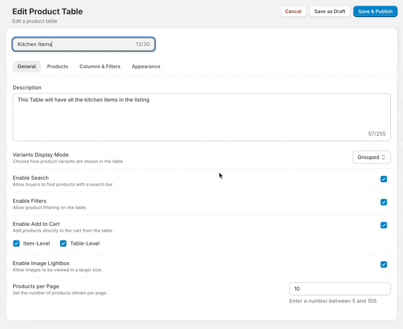
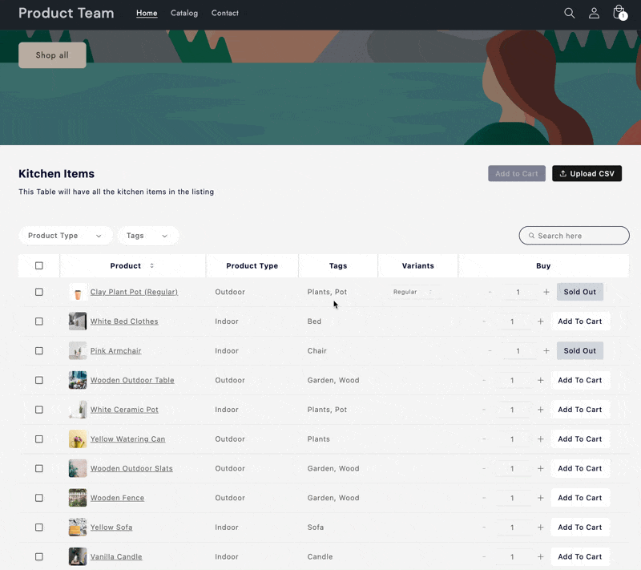
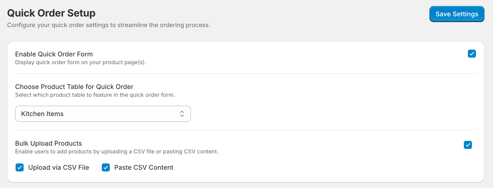
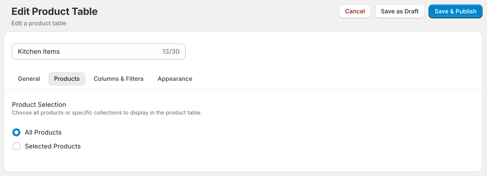

Here we go, with our first major update for the Quick Order app. Before we show and tell, I wanted to thank you, our amazing users, for your feedback and your patience with using a new app from the Shopify App Store.

We are hyper-focused on listening to our users and improving the app with major releases every month and minor releases every two weeks. We are always available for direct support and guarantee to resolve any and all issues within days.

With v1.1, we are bringing powerful new features that include UI enhancements, three variant listing modes, CSV upload, and a streamlined flow for adding bulk buy catalog to your store.

* You can now choose how you want to **display product variants**, with three modes: grouped, ungrouped, and folded. Try them out in product table settings\!

 

* One of the most requested feature – your customers can now place bulk orders via **CSV uploads** and **CSV pasting**. To make it even easier, we have included a template that they can download, fill in their data, and upload for swift ordering.

* An **improved flow** to configure your bulk buying and quick ordering catalog. You can still create more product tables to be used anywhere on your store\!

* We have made it easier for you to **select all products** when creating your quick order catalog or product table.

* All of the tables are now **fully responsive**, no more custom CSS to adjust the width\!  
* A number of bug fixes to improve **product load time**, **filtering**, **tags**, and **search**.

As always, feel free to reach out (please do) if you need help with setting up, or if you face any issues with the app. You can also visit our help portal for in-depth guides to set things up.

Thanks for being a user\!