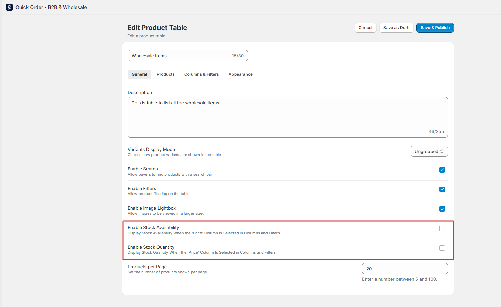
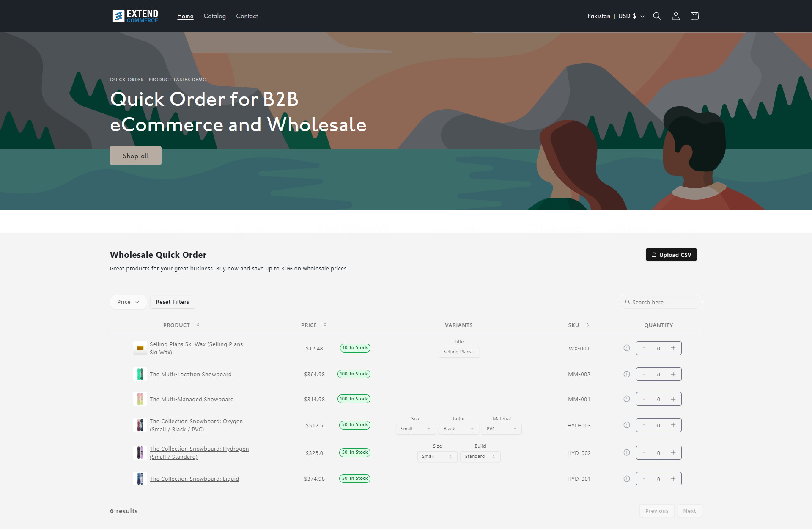

Quick Order v1.2 is here, bringing a host of exciting new features and enhancements aimed at making your customers' shopping experience even better. With personalized catalog pricing, real-time stock status updates, smoother cart functionality, new sorting options, and a refined layout, this update is all about improving ease of use and streamlining the order process. Dive into the release notes below to learn more!

## Catalog Pricing Integration
- Custom pricing catalogs are now fully integrated. This means that your customers will now see personalized pricing to their account and location when they see the quick order tables on your store.
- The tables now also respect all the quantity rules defined in your catalogs.
- We have also added full support for volume based pricing rules defined in you catalogs.

## Stock Status Labels
- Your customers will now be able to quickly identify whether a product is in stock or out of stock with the new stock status labels for products. This works only for products whose inventory is being tracked on Shopify.
- We have added the displaying of exact quantity available for each product, ensuring customers have real-time visibility into inventory levels.

## Improved Cart Functionality
As you adjust the quantity using the counter, items are now directly added to the cart, eliminating extra steps and enhancing the ordering experience.

## New Sorting Option for Quick Order
You can now sort products in the quick order tables by SKU, either in ascending or descending order.

## Improved Quick Order Layout
We’ve made several updates to improve the overall look and feel of the app, including:  
- Enhanced alignment and smoothness for a more polished and seamless experience.  
- Refined the interface for a cleaner and more consistent design.

***