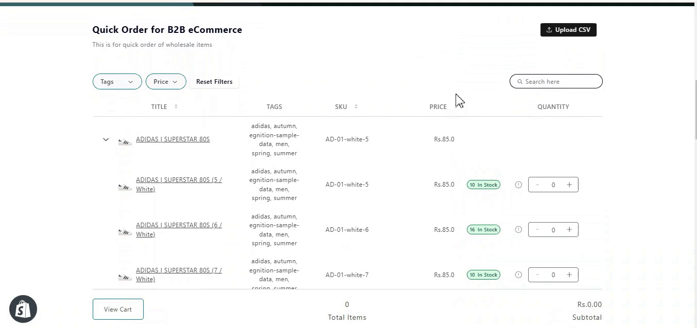

Get ready for a whole new level of convenience and customization! We've been listening to your feedback and packed this release with features that make your Quick Order experience smoother, faster, and more personalized than ever.Here's what we've rolled out:

## 1. Custom CSS for Thumbnails
Want your product thumbnails to match your store's vibe? Now you can customize the CSS for thumbnails in Quick Order! Give your images a little makeover and make them pop in a way that fits your style.
 

## 2. Product and Variant-Specific Metafields Integration
We’ve taken it up a notch with metafields integration; Now you can display product and variant-specific data directly in Quick Order. Whether it’s special info, custom tags, or extra details, you’ve got it at your fingertips.

## 3. Choose Your Buying Behavior
The choice is yours! Do you like to click that "Add to Cart" button? Or prefer it to be done automatically? Now you can decide how your products get added to the cart, giving you more control over your shopping flow.

## 4. Cart Row Integration
Say hello to the new Cart Row Integration! You can now see the quantity of products added to your cart directly within Quick Order. And if you change your mind, just hit the delete button and remove items from the cart with a single click!

## 5. Display Fields as Column, Filter, or Both
Flexibility is key! Now you can choose whether to display a field as a column, a filter, or even both in Quick Order. Customize your tables and filters exactly how you want for a more streamlined experience.

***